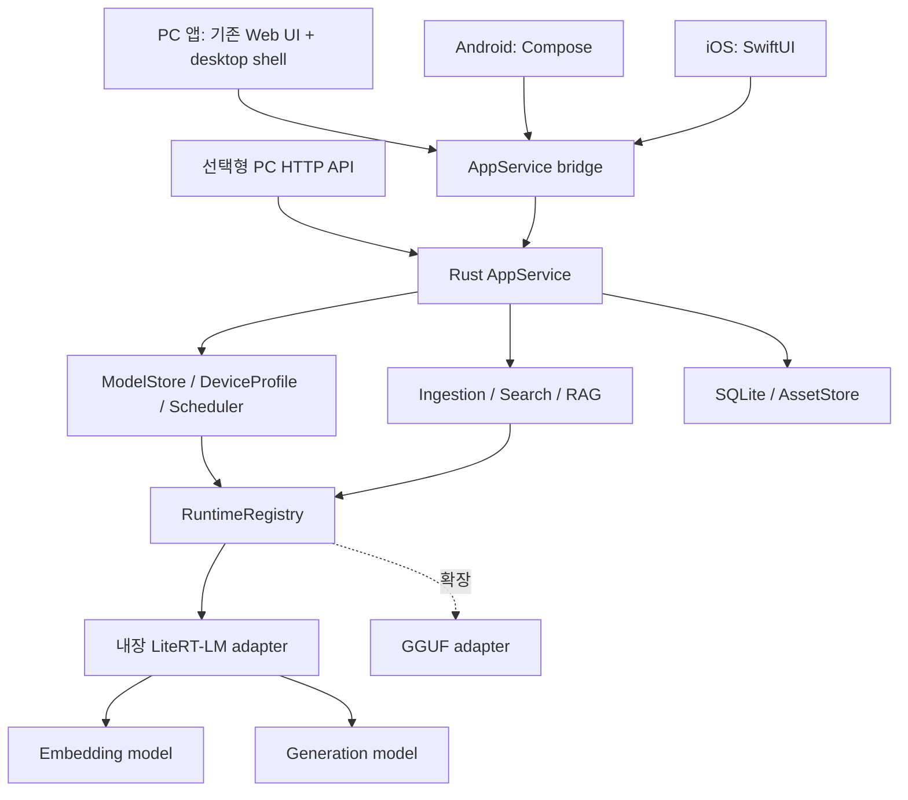

# Local LLM Hub 통합 설계서 — PC·모바일 내장 멀티모달 AI
> Created: 2026-08-18
> Updated: 2026-10-08
> Purpose: 구현 기준 아키텍처 및 단계별 검증 설계
> Status: 목표 설계. 현재 동작하는 코드는 아래 Current Implementation Baseline과 구분한다.

## 0. Goals and Deliverables

### Primary Goal
Ollama나 Python을 별도로 설치하지 않고 Windows·macOS·Linux·Android·iOS 앱에서 모델을 직접 실행하는 로컬 우선 멀티모달 AI 제품을 설계한다. 공통 Rust 코어와 내장 런타임을 공유하고 플랫폼별 앱으로 배포한다. 첫 출시의 기본 범위는 문서·사진 검색과 근거 기반 대화이며, 음성·영상 검색은 같은 데이터 계약 위에서 확장한다. EmbeddingGemma 2를 검색용, 검증된 소형 생성 모델을 답변용으로 분리한다. Qwen3, DeepSeek-R1 Distill 7B, Gemma 4, Mistral Small 3, Phi-4 Mini 및 gpt-oss는 확장 카탈로그 대상으로 유지한다. 모델 revision은 카탈로그 릴리스에 고정하며 임의 latest로 자동 변경하지 않는다.

### Success Definition
- 사용자가 10분 이내에 장치 진단부터 권장 모델 설치, 첫 스트리밍 대화까지 완료한다.
- 모바일에서 지원 판정을 통과한 소형·양자화 모델을 비행기 모드에서도 직접 실행한다.
- 장치 RAM, 저장공간, CPU/GPU/NPU, OS, 모델 포맷을 바탕으로 `권장`, `실행 가능`, `비권장`, `지원 불가`를 근거와 함께 표시한다.
- PDF, Markdown, TXT, 웹페이지, 동기화 폴더를 프로젝트 지식으로 추가하고 답변에 출처를 표시한다.
- MCP 서버와 도구는 프로젝트별로 활성화하며, 민감한 도구 호출 전에 사용자 승인을 받는다.
- 대화 내용, 문서 원문, 임베딩은 기본적으로 로컬에만 저장되고 외부 통신은 명시적 동의 및 허용 목록을 따른다.
- PC·모바일이 같은 대화·프로젝트·미디어 도메인 계약을 사용한다. 모바일 앱 내부 호출에는 HTTP 서버가 필요하지 않고, PC 개발자 API는 공통 코어 위의 선택형 인터페이스다.
- 최초 출시 gate는 플랫폼별 검증된 임베딩 모델 1개와 생성 모델 1개다. 기존 5개 모델군 전체 지원은 확장 단계의 목표이며 첫 출시를 막지 않는다.
- 모델별 chat template, thinking mode, tool calling, vision, context length 차이가 capability로 표현되고 대화·RAG·MCP UI가 이를 존중한다.
- Ollama 미설치·Python 미설치 상태에서 설치, 문서·사진 색인, 검색, 근거 기반 대화, 종료·복원이 동작한다.
- 텍스트로 사진을 검색하고 결과를 원본 위치로 열 수 있다. 확장 단계에서는 음성·영상 검색 결과가 구간 시작·종료 시점으로 연결된다.

### Out of Scope
- 1차 버전에서 모델 학습, 파인튜닝, 분산 학습, 클라우드 추론 서비스를 직접 제공하지 않는다.
- 임의의 Hugging Face 모델을 검증 없이 모바일 실행 포맷으로 자동 변환하지 않는다.
- 모바일에서 대형 서버급 모델의 실행을 보장하지 않는다.
- MCP 서버의 안전성을 플랫폼이 보증하지 않으며, 샌드박스 밖 무제한 실행을 허용하지 않는다.
- 1차 버전에서 음성·영상 생성이나 멀티 사용자 실시간 공동 편집은 다루지 않는다.

## 1. Working Context

### Background
로컬 LLM 생태계는 모델 저장소, 양자화 포맷, 실행 엔진, 하드웨어 가속 방식이 분산되어 있다. 사용자는 모델 이름만으로 자신의 장치에서 실행 가능한지 판단하기 어렵고, RAG 및 MCP를 붙이려면 별도의 벡터 DB, 문서 파서, 서버 설정과 보안 판단이 필요하다. 이 프로젝트는 이 복잡성을 하나의 설치·대화·프로젝트 경험으로 묶는다.

2026-08-21 공식 자료 조사 기준 Gemma 4는 E2B, E4B, 12B, 31B, 26B-A4B 변형을 제공하며, Google LiteRT-LM은 Android, iOS, 데스크톱을 포함한 엣지 실행을 지향한다. Qwen3는 공식 GGUF와 모바일 실행 경로를 제공한다. DeepSeek-R1 Distill Qwen 7B는 Qwen2.5 기반 추론 특화 모델이다. Mistral Small 3.0은 24B Apache 2.0 모델이지만 현재 공식 문서상 retired 상태이므로 호환성 지원 대상으로 유지하되 신규 기본 추천에서는 후속 모델을 함께 안내한다. Phi-4 Mini Instruct는 3.8B급, 128K context, MIT 모델로 자원 제한 환경을 주요 용도로 명시한다. `최신 모델`, `영상 속 호환 모델`, `현재 장치에 적합한 모델`을 별도 축으로 관리한다.

참고 공식 자료:
- [Gemma releases](https://ai.google.dev/gemma/docs/releases)
- [Gemma 4 overview](https://ai.google.dev/gemma/docs/core)
- [Google LiteRT-LM](https://github.com/google-ai-edge/LiteRT-LM)
- [Qwen official organization](https://github.com/QwenLM)
- [Qwen 3.6 repository](https://github.com/QwenLM/Qwen3.6)
- [Qwen3 local llama.cpp guide](https://github.com/QwenLM/Qwen3/blob/main/docs/source/run_locally/llama.cpp.md)
- [DeepSeek-R1 official repository](https://github.com/deepseek-ai/DeepSeek-R1)
- [Mistral Small 3 announcement](https://mistral.ai/news/mistral-small-3)
- [Mistral Small 3.0 lifecycle status](https://docs.mistral.ai/models/mistral-small-3-0-25-01)
- [Phi-4 Mini Instruct model card](https://huggingface.co/microsoft/Phi-4-mini-instruct)

### Objective
Codex 구현 흐름은 요구사항과 공식 모델 메타데이터를 수집하고, Rust 중심의 코어 아키텍처와 플랫폼별 런타임 어댑터, 모델 적합성 판정, 대화, RAG, MCP, 보안, 검증 계약을 재현 가능한 산출물로 만든다.

### Scope
- Included: 장치 진단, 동적 모델 카탈로그, 다운로드/검증/삭제, 로컬 추론, 스트리밍 채팅, 프로젝트/대화 저장, RAG 수집·검색·출처, MCP 등록·권한·호출, OpenAI 호환 API, 웹/데스크톱/Android/iOS 클라이언트 계약.
- Excluded: 학습·파인튜닝, 미검증 자동 변환, 퍼블릭 클라우드 호스팅, 엔터프라이즈 SSO/RBAC, 모델 라이선스 법률 자문.

### Inputs
| Item | Format | Source | Notes |
|---|---|---|---|
| 제품 요구사항 | md/json | user | 대상 플랫폼, 개인정보, UX 범위 |
| 장치 프로필 | json | system | OS, arch, RAM, 가용 저장공간, CPU/GPU/NPU, 배터리/열 상태 |
| 모델 메타데이터 | json/api | official registry | 검색/생성 기본 패키지 및 확장 family, 모델 ID, revision, 파일, 해시, 라이선스, 포맷, 메모리 요구량 |
| 런타임 capability | json | runtime adapter | 지원 포맷, 가속기, 컨텍스트, tool calling 지원 |
| 사용자 문서 | pdf/md/txt/html | user/file/url | 로컬 저장 기본 |
| MCP 설정 | json | user/registry | 실행 명령 또는 원격 endpoint, 권한 선언 |
| 대화 요청 | json | client | 프로젝트, 모델, 메시지, 첨부, 생성 옵션 |

### Outputs
| Item | Format | Destination | Notes |
|---|---|---|---|
| 모델 추천 결과 | json | local API/UI | 등급, 예상 메모리·속도, 근거, 경고 포함 |
| 설치된 모델 | model files + json | managed local storage | revision, hash, provenance 기록 |
| 스트리밍 대화 | SSE/WebSocket/JSON | client | 토큰, 상태, 인용, tool event |
| RAG 인덱스 | SQLite + vector index | app data | 원문·청크·임베딩 버전 관리 |
| MCP 권한 정책 | json | encrypted app config | 프로젝트/서버/도구별 allow/ask/deny |
| 감사 로그 | jsonl | local app data | 다운로드, 권한 승인, 도구 호출; 비밀 값 제거 |
| 구현 계약 | md/json schema | docs/contracts | 플랫폼 공통 API 및 어댑터 규격 |

### Constraints
- 로컬 우선: 대화, 문서, 임베딩은 기본 외부 전송 금지. 모델 정보 업데이트만 opt-in 네트워크 접근을 허용한다.
- Rust 우선: 새 네이티브 코어와 시스템 로직은 Rust로 작성한다. C/C++ 런타임이 필수인 경우 Rust FFI 어댑터 뒤에 격리하고 메모리 안전 경계를 문서화한다.
- 모바일 직접 실행은 필수이며 Android와 iOS 모두 지원 대상으로 삼는다. 다만 런타임별 지원 격차는 capability 판정으로 노출한다.
- 대형 모델 다운로드는 중단 재개, 해시 검증, 충분한 여유 공간 확인, Wi-Fi/충전 조건 설정이 필요하다.
- 모델 라이선스, gated access, 배포 조건을 설치 전에 표시하고 사용자 동의를 기록한다.
- 모델이 선언한 메모리 요구량만 믿지 않고 최초 실행 micro-benchmark와 OOM 안전 여유를 적용한다.
- 성능은 decode tokens/s 하나로 판단하지 않고 prefill, TTFT, decode, total completion, peak memory, task success를 분리한다.
- coding/agent 평가는 requirement coverage, plan-to-code traceability, first-run success, manual intervention time, energy를 포함한다.
- 모델 weights, KV cache, runtime overhead, OS reserve를 합산하고 dense/MoE의 total parameter와 active parameter를 구분한다.
- load admission과 지속 실행 상태를 분리하고 memory pressure·swap·thermal 임계치를 넘으면 context/variant 조정 또는 안전 unload한다.
- MCP는 로컬 프로세스(stdio)와 원격 HTTP 계열 전송을 구분하며, 모바일에서는 임의 바이너리 실행을 허용하지 않고 원격 또는 앱 내장 MCP만 지원한다.
- 웹페이지 수집은 robots, 인증, 저작권, 네트워크 동의를 준수하며 기본적으로 사용자가 지정한 URL만 처리한다.
- Assumption: PC는 기존 웹 UI를 재사용하는 데스크톱 셸, Android는 Kotlin/Compose, iOS는 SwiftUI를 사용한다. 세 UI가 Rust application service를 호출하며 모바일은 localhost 서버를 띄우지 않는다. 셸 선택은 5.3의 기술 검증 gate를 따른다.
- Assumption: 서버 모드는 단일 사용자/신뢰 네트워크를 우선하고 다중 사용자 RBAC는 후속 단계다.
- 원격 추론은 pairing된 Trusted Node만 허용하고 TLS, scoped token, revocation, local/VPN 우선 경로를 사용한다.
- Portable Workspace는 PoC 범위이며 host RAM·temporary file·OS log 흔적을 완전히 제거한다고 보장하지 않는다.
- cloud fallback은 기본 비활성화하며 프로젝트별 명시 동의, 전송 preview, redaction, 비용·token 제한이 필요하다.
- `지원`은 family 이름 인식만을 뜻하지 않는다. 공식/승인된 artifact 다운로드, template 적용, 추론, 중지, 대화 복원, RAG, 지원 가능한 MCP tool calling까지 검증되어야 한다.
- Mistral Small 3.0은 retired 모델이므로 카탈로그에 `compatibility` badge와 후속 모델 안내를 표시하고 보안·포맷 호환 패치는 유지하되 기본 자동 추천 우선순위는 낮춘다.
- 영상 속 벤치마크·VRAM·라이선스 문구는 마케팅 참고값으로만 보존하며, 제품 판정은 pinned model card, 실제 artifact license, 장치별 benchmark에 따른다.

### Terms
| Term | Definition |
|---|---|
| Model Catalog | 설치 가능 아티팩트, family, revision, 라이선스, 포맷, runtime compatibility를 담은 서명된 목록 |
| Required Five | Qwen3, DeepSeek-R1 Distill Qwen 7B, Gemma 4, Mistral Small 3, Phi-4 Mini의 확장 호환성 대상; 첫 출시 gate와 구분 |
| Device Profile | 장치 자원과 가속기 capability를 정규화한 스냅샷 |
| Fit Score | 모델과 장치의 실행 적합성을 메모리, 성능, 기능, 안정성으로 평가한 점수 |
| Runtime Adapter | 공통 추론 계약을 LiteRT-LM, llama.cpp 계열, MLX, 서버 엔진 등에 연결하는 계층 |
| Project | 대화, 기본 모델, 시스템 지침, 지식베이스, MCP 정책의 격리 단위 |
| Local-first | 데이터와 추론을 기본적으로 장치 내부에서 처리하고 외부 통신은 선택적으로 허용하는 정책 |
| ModelRuntime | API 계층과 특정 추론 엔진 사이의 Rust 비동기 trait 계약 |
| RuntimeEvent | 설치 진행률, 토큰, 지표, OpenAI chunk, 완료를 표현하는 런타임 독립 이벤트 |
| Provenance | provider, endpoint, 실제 모델, digest, 지연시간, 구조화 출력 모드를 기록한 실행 근거 |

### Runtime Adapter Architecture

API와 UI는 특정 엔진의 URL, NDJSON, 모델 파일 형식을 직접 알지 않는다. 목표 구조는 설치를 `ModelStore`, 생성·임베딩을 `InferenceRuntime`, 선택·적재를 `RuntimeRegistry`로 나눈다. 현재 `ModelRuntime`은 전환 기간의 호환 계약이며 HTTP payload를 도메인 계약으로 사용하지 않는다. 어댑터는 엔진 응답을 정규화된 이벤트와 오류로 변환한다. 상세 타입과 FFI 경계는 5.4~5.6에 정의한다.

| Adapter | Target | Integration mode | Initial status | Responsibility |
|---|---|---|---|---|
| `LiteRtLmRuntime` | PC/Android/iOS primary | 앱 내장 SDK, 공통 Rust 계약 뒤 플랫폼 bridge | designed, project unverified | 임베딩·멀티모달 생성, 기기 가속, lifecycle 연동 |
| `LlamaCppRuntime` | PC GGUF expansion | 앱 배포물에 포함한 worker/FFI | optional, project unverified | LiteRT artifact가 없는 모델의 명시적 호환 경로 |
| `OllamaRuntime` | 기존 개발판 migration only | local HTTP sidecar | current code only | 전환 회귀 테스트; 새 제품 필수 의존성·자동 fallback에서 제외 |
| `SentenceTransformers` | 개발·수치 비교 전용 | 기존 Python service | text CPU verified | native adapter의 품질 비교 기준; 제품 앱에 포함하지 않음 |
| `MistralRsRuntime` / `MLX` | 향후 특수 최적화 | 별도 adapter | deferred | 실측 이점이 있을 때만 도입 |

목표 `AppState`는 transport-independent application service를 참조한다. 현재 코드는 `Arc<dyn ModelRuntime>`과 별도 `EmbeddingRuntime`을 보유한다. 새 어댑터는 health/list, non-stream/stream chat, embedding, cancellation, timeout, 오류 정규화, modality별 입력, provenance conformance suite를 통과해야 등록된다. `RuntimeRegistry`가 플랫폼·아티팩트·정책·실측 capability로 선택하며 자동 cloud/Ollama fallback은 금지한다.

모델 카탈로그는 장기적으로 단일 `runtime_model` 문자열에서 `runtime_variants[]`로 이전한다. 각 variant는 `runtime`, `artifact_id`, `format`, `revision`, `checksum`, `platforms`, `capabilities`, `stability`를 갖는다. 기존 필드는 마이그레이션 기간 동안 Ollama 호환 alias로 읽는다.

### mj-narmer Integration Contract

`mj_llm_wrapper_request.md`를 Narmer 연동 요구사항의 입력 문서로 사용한다. 책임 경계는 다음과 같다.

- Gateway: 런타임 연결, OpenAI 호환 생성, 구조화 출력 검증, timeout/cancellation, 오류 정규화, provenance, 로컬/외부 실행 정책과 비밀값 마스킹.
- mj-narmer: URL·YouTube evidence 수집, 장소 추출 prompt/schema, evidence-backed claim 검증, place resolution, 사용자 데이터 영속화.
- Gateway는 Narmer의 장소 도메인이나 데이터베이스를 알지 않으며, Narmer는 특정 로컬 런타임 프로토콜을 알지 않는다.

P0 공유 source of truth는 `contracts/openapi.yaml`이다. `POST /v1/chat/completions`는 `stream` 양쪽 모드와 `json_object`, 제한된 MVP `json_schema` 검증을 제공한다. 성공 응답의 `mj`에는 동적 provider, 비밀값이 제거된 endpoint ID, 요청/실행 모델, 가능한 digest, latency와 structured-output mode를 기록한다. 오류는 요청서에 정의된 안정적인 OpenAI error envelope code를 사용한다. `Authorization: Bearer`가 표준이며 `x-local-token`은 이전 UI 호환 기간에만 유지한다.

현재 `/v1/embeddings`는 선택형 Python 서비스의 텍스트 요청을 지원한다. 내장 런타임 전환은 같은 텍스트 계약을 유지하고 멀티모달 요청은 `/api/v2` 계약으로 구분한다. load admission, queue, 다중 `RuntimeRegistry`는 첫 native release의 필수 사항이다. 전체 JSON Schema validator, 비용 회계, Responses API는 별도 확장이다.

## 2. Workflow Definition

### End-to-End Flow
`[Requirements + Official Metadata] -> [Step 01 Capability Baseline] -> [Step 02 Architecture Contracts] -> [Step 03 Catalog and Fit Engine] -> [Step 04 Model Lifecycle] -> [Step 05 Conversation Runtime] -> [Step 06 RAG Pipeline] -> [Step 07 MCP Security] -> [Step 08 Cross-platform Validation] -> [Implementation-ready Blueprint]`

### LLM vs Code Boundary
| LLM handles | Code handles |
|---|---|
| 요구사항 누락 탐지, 모델 용도 분류, UX 문구 초안, 위험·trade-off 평가, 검색 문맥 구성 | 장치 탐지, 메모리 계산, 해시/서명 검증, 다운로드, DB I/O, 청킹, 임베딩, 벡터 검색, 권한 집행, API/스키마 검증 |
| 모델 설명과 라이선스 요약, 적합성 결과의 자연어 설명 | 적합성 등급 계산 및 hard constraint 판정 |
| RAG 결과로 답변 생성, 인용할 청크 선택 | 문서 파싱, 중복 제거, ACL 필터, top-k 검색, 인용 ID 검증 |
| MCP 도구 선택과 인자 제안 | 도구 schema 검증, 승인 확인, sandbox 실행, timeout/출력 제한, 감사 로그 |
| 작업 복잡도 분류와 planner/implementer/reviewer 후보 제안 | capability score 기반 허용 경로, 최소 context handoff, acceptance test, intervention event 기록 |
| Quick/Balanced/Deep profile과 신규 후보 승격 판단 | memory admission, swap/pressure 감시, fallback 순서, catalog gate를 결정론적으로 집행 |

#### Step 01: Establish Capability Baseline
1) Step Goal:
공식 자료와 실제 대상 장치군을 기준으로 기본 검색/생성 패키지와 확장 모델군의 모델·런타임·플랫폼 지원 매트릭스를 만든다.

2) Input / Output:
- Input: 제품 요구사항, 공식 모델 카드, 런타임 문서, 표본 장치 프로필.
- Output: versioned capability matrix와 미확정 항목 목록.

3) LLM Decision Area:
문서 간 표현 차이를 정규화하고, `공식 지원`, `실험적`, `미검증`, `불가`를 구분한다.

4) Code Processing Area:
공식 endpoint에서 메타데이터를 수집하고 revision, checksum, 크기, 포맷 필드를 schema로 검증한다.

5) Success Criteria:
기본 검색/생성 패키지의 Android/iOS/desktop 지원 상태가 근거 URL 및 확인일과 함께 존재한다. 첫 출시 대상 조합은 실기기 검증을 통과해야 한다. 확장 모델군의 미지원은 근거가 있는 명시적 상태로 기록한다.

6) Validation Method:
JSON Schema 검사, 출처 URL 접근 검사, 사람이 모바일 지원 표본을 검토한다.

7) Failure Handling:
공식 정보가 없거나 충돌하면 자동 추정하지 않고 `unverified`로 표시한다. 네트워크 오류는 지수 backoff로 3회 재시도 후 기존 서명 카탈로그를 사용한다.

8) Skills / Scripts:
- Skill: `model-catalog-curator`
- Script: `.agents/skills/model-catalog-curator/scripts/normalize_catalog.rs`

9) Intermediate Artifact Rule:
`output/step01_capability_matrix.json`

#### Step 02: Define Architecture and Contracts
1) Step Goal:
Rust 코어, 런타임 어댑터, 저장소, API, 플랫폼 UI 사이의 안정적인 경계를 정의한다.

2) Input / Output:
- Input: capability matrix, 개인정보·플랫폼 제약.
- Output: 컴포넌트 책임, API schema, event/state 계약, threat boundary.

3) LLM Decision Area:
변경 가능성이 큰 런타임 세부 구현과 장기 유지할 도메인 계약의 경계를 판단한다.

4) Code Processing Area:
`InferenceRuntime`, `ModelStore`, `RuntimeRegistry`, 정규화된 content/event/error, OpenAPI/JSON Schema, DB migration 규칙을 정적 검사한다. UI bridge와 HTTP facade가 같은 application service를 사용하도록 의존 방향을 검사한다. 기존 Ollama parsing은 migration adapter 내부에만 남긴다.

5) Success Criteria:
클라이언트가 특정 엔진을 알지 않고도 모델 설치, 대화, RAG, MCP를 호출할 수 있고 어댑터 교체가 DB/API 변경을 강제하지 않는다. mj-narmer가 `base_url=/v1`과 Bearer token만으로 비스트리밍 장소 추출을 요청하고 표준 provenance/error를 받을 수 있다.

6) Validation Method:
`contracts/openapi.yaml` 정적 검사, mock adapter conformance test, Narmer JSON fixture, dependency direction 검사, architecture decision record의 human review.

7) Failure Handling:
플랫폼별 capability가 공통 계약을 충족하지 못하면 optional capability로 격리하고 UI에서 기능을 숨긴다. 핵심 대화 계약 불충족 시 해당 어댑터 채택을 중단한다.

8) Skills / Scripts:
- Skill: `local-llm-architecture`
- Script: `scripts/validate_contracts.rs`

9) Intermediate Artifact Rule:
`output/step02_architecture_contracts.md`

#### Step 03: Design Catalog and Device Fit Engine
1) Step Goal:
장치에 맞는 모델 variant와 runtime을 안전하게 추천하고 설치 불가 원인을 설명한다.

2) Input / Output:
- Input: Device Profile, Model Catalog, runtime capability, 사용자 목적.
- Output: ranked recommendation JSON과 예상 자원·품질·기능 trade-off.

3) LLM Decision Area:
`일반 대화`, `코딩`, `추론`, `긴 문서`, `도구 사용`, `멀티모달` 목적의 가중치와 모델 family별 설명 문구를 구성한다.

4) Code Processing Area:
hard filter(arch/format/runtime/license/storage), 예상 peak RAM(`weights + KV cache + runtime overhead + OS reserve + safety margin`), GPU residency/offload, disk reserve, thermal tier, benchmark score를 결정론적으로 계산한다.

결과에는 `ARTIFACT_FITS`, `SESSION_STARTABLE`, `SUSTAINED_SAFE`를 별도 boolean과 근거로 기록한다.

5) Success Criteria:
같은 입력은 같은 추천을 만들고, 지원 불가 모델은 설치 버튼이 비활성화되며 구체적 이유와 같은 family의 작은 variant 또는 대안 모델이 표시된다.

개발 workload에서는 planning, implementation, review 점수를 분리해 단일 모델 고정과 단계별 routing 후보를 모두 반환한다.

6) Validation Method:
golden device fixtures, 경계값/property tests, dense/MoE 및 context/KV-cache fixtures, 실제 저·중·고사양 장치 benchmark 비교.

7) Failure Handling:
장치 정보가 누락되면 보수적 CPU/RAM 기준을 사용하고 `측정 필요`로 표시한다. 최초 실행 OOM, swap 급증 또는 과열 시 context 축소 → 작은 quant/variant → unload 순으로 대응하고 자동 재실행은 한 번만 허용한다.

8) Skills / Scripts:
- Skill: `device-model-advisor`
- Script: `.agents/skills/device-model-advisor/scripts/score_fit.rs`

9) Intermediate Artifact Rule:
`output/step03_model_fit_report.json`

#### Step 04: Design Secure Model Lifecycle
1) Step Goal:
모델 탐색, 라이선스 동의, resumable download, 검증, 설치, 최적화, rollback, 삭제를 정의한다.

2) Input / Output:
- Input: 선택된 catalog artifact, 저장 위치, 네트워크/배터리 정책.
- Output: 검증된 model installation record와 runtime-ready artifact.

3) LLM Decision Area:
라이선스 핵심 조건과 실패 원인을 사용자가 이해할 수 있는 언어로 요약한다.

4) Code Processing Area:
URL allowlist, TLS, byte-range download, 임시 파일, 크기/hash/signature 검증, atomic rename, 캐시 참조계수, 삭제 전 사용 여부 검사를 수행한다.

5) Success Criteria:
부분 다운로드나 위조 파일이 실행 경로에 진입하지 않고, 설치 중 앱 종료 후 재개 가능하며, 동일 revision을 중복 저장하지 않는다.

6) Validation Method:
corrupt/truncated artifact 테스트, 디스크 부족 fault injection, checksum fixture, 설치/삭제 state-machine 테스트.

7) Failure Handling:
해시 불일치 시 파일을 격리하고 재시도 1회 후 중단한다. 공간 부족 시 필요한 추가 용량을 표시한다. gated model 인증 실패 시 토큰 입력을 요청하되 토큰을 로그에 남기지 않는다.

8) Skills / Scripts:
- Skill: `model-lifecycle-manager`
- Script: `.agents/skills/model-lifecycle-manager/scripts/verify_artifact.rs`

9) Intermediate Artifact Rule:
`output/step04_installation_manifest.json`

#### Step 05: Build Conversation Runtime Contract
1) Step Goal:
현재 대화와 같은 멀티턴 스트리밍 채팅을 프로젝트 및 모델 전환과 함께 제공한다.

2) Input / Output:
- Input: project, conversation history, selected model, system policy, attachments, generation options.
- Output: token stream, final assistant message, usage/latency metrics, citations, tool events.

3) LLM Decision Area:
답변 생성, 대화 문맥 축약, RAG 사용 판단, MCP 도구 호출 제안, 모델 전환 시 맥락 유지 전략을 담당한다.

4) Code Processing Area:
chat template 적용, tokenizer/context budget 계산, cancellation, 요청별 timeout, backpressure, persistence, retry idempotency, SSE/WebSocket 변환을 수행한다. 비스트리밍 structured output은 JSON parse 후 Narmer가 사용하는 JSON Schema subset을 검증하고 실패를 `structured_output_invalid`로 반환한다.

5) Success Criteria:
대화 생성·이름 변경·검색·삭제, 메시지 수정 후 분기, 모델/로컬·Trusted Node routing 전환, 응답 중지가 가능하고 앱 재시작 후 복원된다. OpenAI 비스트리밍 응답에는 provider, sanitized endpoint, requested/resolved model, 가능한 digest, latency, structured output mode가 포함된다.

6) Validation Method:
API contract tests, 긴 대화 context-budget tests, stream cancellation tests, golden chat-template tests, node disconnect/reconnect 및 routing failover tests.

7) Failure Handling:
컨텍스트 초과 시 최근 메시지와 고정 메시지를 보존해 요약을 제안한다. runtime crash는 세션을 복구하고 미완료 메시지를 명시한다. 자동 재생성은 중복 부작용이 없는 경우 1회로 제한한다.

8) Skills / Scripts:
- Skill: `conversation-runtime`
- Script: `scripts/validate_chat_events.rs`

9) Intermediate Artifact Rule:
`output/step05_conversation_contract.json`

#### Step 06: Build Local RAG Pipeline
1) Step Goal:
PDF, Markdown, TXT, 사진을 로컬 지식베이스로 만들고 근거 있는 답변을 제공한다. 음성·영상 구간, 웹페이지, 폴더 감시는 후속 단계에서 같은 source/segment 계약으로 추가한다.

2) Input / Output:
- Input: 승인된 문서/미디어 자산, parser policy, embedding profile, query.
- Output: versioned segments, embedding-space별 index, retrieval results, 페이지·사진·시간 범위 citations.

3) LLM Decision Area:
질의 재작성, 검색 결과 관련성 보조 판정, 충분한 근거 여부, 인용 기반 답변을 담당한다.

4) Code Processing Area:
파일 type 감지, parsing, content hash, incremental sync, chunking, embedding batch, vector/keyword hybrid search, metadata/프로젝트 ACL filtering을 수행한다.

5) Success Criteria:
변경된 문서만 재색인하고, 답변의 모든 citation이 존재하는 source/chunk로 역참조되며, 프로젝트 간 문서가 섞이지 않는다.

6) Validation Method:
parser fixture, retrieval benchmark, citation referential-integrity 검사, 프로젝트 격리 테스트, 한국어 질의 평가셋.

7) Failure Handling:
암호화/손상 PDF는 사용자에게 알리고 건너뛴다. embedding 모델 변경 시 별도 index version을 만들고 완료 후 atomic switch한다. 웹 수집 실패는 원본 캐시가 있을 때만 stale 표시로 사용한다.

8) Skills / Scripts:
- Skill: `local-rag-pipeline`
- Script: `.agents/skills/local-rag-pipeline/scripts/validate_index.rs`

9) Intermediate Artifact Rule:
`output/step06_rag_evaluation.json`

#### Step 07: Build MCP Registry and Permission Gateway
1) Step Goal:
MCP 서버 등록·연결·도구 발견·승인·실행을 프로젝트별 최소 권한으로 제공한다.

2) Input / Output:
- Input: MCP manifest/endpoint, tool schemas, project policy, proposed tool call.
- Output: allow/ask/deny decision, sanitized result, audit event.

3) LLM Decision Area:
사용자 의도에 맞는 도구 선택과 인자를 제안하고, 승인이 필요한 행위를 자연어로 설명한다.

4) Code Processing Area:
schema validation, executable/host allowlist, secret injection, filesystem/network scope, timeout, output limit, consent token, audit/redaction을 강제한다.

5) Success Criteria:
승인되지 않은 도구는 실행되지 않고, 권한 범위는 프로젝트별로 격리되며, 모바일은 임의 로컬 프로세스를 시작하지 않는다.

6) Validation Method:
malicious MCP fixtures, command/path traversal tests, SSRF tests, approval replay tests, secret redaction 검사.

7) Failure Handling:
schema 불일치나 권한 위반은 즉시 deny하고 기록한다. timeout은 프로세스/요청을 종료한다. 동일 서버가 3회 연속 실패하면 circuit-open 상태로 전환하고 사용자 재활성화를 요구한다.

8) Skills / Scripts:
- Skill: `mcp-permission-auditor`
- Script: `.agents/skills/mcp-permission-auditor/scripts/validate_policy.rs`

9) Intermediate Artifact Rule:
`output/step07_mcp_threat_report.json`

#### Step 08: Validate Cross-platform Release Readiness
1) Step Goal:
대표 장치와 실패 조건에서 설치·대화·RAG·MCP 전체 흐름의 출시 준비도를 판정한다.

2) Input / Output:
- Input: 이전 단계 계약/산출물, 장치 matrix, test corpus, performance budget.
- Output: release gate report, known limitations, rollback criteria.

3) LLM Decision Area:
정성적 대화/RAG 품질을 평가하고 잔여 위험의 출시 허용 여부를 제안한다.

4) Code Processing Area:
unit/integration/E2E, cold/warm prefill·TTFT·decode·peak-memory benchmark, sustained thermal/energy test, offline test, network deny test, 격리된 Project Arena의 code build/test/run·requirement coverage·manual intervention 측정, migration/rollback, SBOM/license scan을 실행한다.

5) Success Criteria:
최초 출시는 Android/iOS 각 1개 이상 기준 실기기와 desktop 3 OS에서 필수 시나리오를 통과해야 한다. 지원 tier를 확대할 때마다 추가 실기기 gate를 적용한다. P0/P1 결함이 없고 estimated/measured 성능과 알려진 제한이 UI와 문서에 표시되어야 한다.

6) Validation Method:
CI matrix, physical-device test report, schema validator, human acceptance test, security checklist.

7) Failure Handling:
P0/P1 또는 데이터 유출 가능성은 release abort다. 특정 어댑터만 실패하면 feature flag로 비활성화하고 이전 catalog/runtime으로 rollback한다. 성능 미달은 추천 등급 하향 후 재검증한다.

8) Skills / Scripts:
- Skill: `local-llm-release-auditor`
- Script: `scripts/release_gate.rs`

9) Intermediate Artifact Rule:
`output/step08_release_gate.json`

### State Model
| State | Entry Condition | Exit Condition | Next State |
|---|---|---|---|
| `COLLECTING_REQUIREMENTS` | 플랫폼, 개인정보, 모델, 대화/RAG/MCP 요구를 수집 중 | 필수 요구와 가정이 기록됨 | `PLANNING` |
| `PLANNING` | 아키텍처와 단계별 계약을 설계 중 | 실행/검증 계획과 schema가 준비됨 | `RUNNING_SCRIPT` or `VALIDATING` |
| `RUNNING_SCRIPT` | 수집, 정규화, scoring, 검증 스크립트 실행 중 | 성공 또는 복구 불가 실패가 확인됨 | `VALIDATING` or `FAILED` |
| `VALIDATING` | 산출물 구조, 보안, 품질, 플랫폼 지원을 확인 중 | 판정 결과가 확정됨 | `DONE` or `NEEDS_USER_INPUT` or `FAILED` |
| `NEEDS_USER_INPUT` | 라이선스, 네트워크, 권한, 위험 수용 등 사람 판단 필요 | 사용자가 명시적으로 선택함 | `PLANNING` or `DONE` |
| `DONE` | 구현 가능한 설계와 검증 결과가 승인됨 | Terminal | none |
| `FAILED` | 무결성, 권한, 핵심 플랫폼 지원 등 복구 불가 조건 발생 | Terminal | none |

## 3. Implementation Spec

### Recommended Folder Structure
```text
/project-root
  AGENTS.md
  Cargo.toml
  /apps
    /desktop-web              # responsive web UI + desktop shell
    /android                  # native mobile host and UI
    /ios                      # native mobile host and UI
  /crates
    /domain                   # Project, Conversation, Model, KnowledgeBase
    /device-profile           # hardware/capability detection
    /model-catalog            # signed catalog, license, provenance
    /model-fit                # deterministic recommendation engine
    /memory-admission        # load/sustained safety and pressure guard
    /benchmark-core          # TTFT, throughput, memory, task completion
    /project-arena           # paired project runs and acceptance evidence
    /capability-router       # planner/implementer/reviewer model routing
    /model-store              # resumable download and verified storage
    /inference-core           # runtime-neutral session/stream contracts
    /runtime-litert           # LiteRT-LM FFI adapter
    /runtime-gguf             # GGUF/llama.cpp-family FFI adapter
    /runtime-mlx              # Apple Silicon optimized adapter
    /runtime-mobile           # MNN/ExecuTorch-style mobile adapter boundary
    /runtime-server           # optional server runtime adapter
    /rag-core                 # ingestion, index, retrieval, citations
    /mcp-gateway              # transports, policy, approval, sandbox
    /persistence              # SQLite migrations and encrypted secrets
    /local-api                # OpenAI-compatible + native management API
    /trusted-node             # secure pairing, routing, revocation
    /portable-workspace       # external-storage PoC and host trace policy
  /contracts
    openapi.yaml
    model-catalog.schema.json
    device-profile.schema.json
    chat-events.schema.json
    mcp-policy.schema.json
  /.agents
    /skills
      /model-catalog-curator
      /device-model-advisor
      /model-lifecycle-manager
      /conversation-runtime
      /local-rag-pipeline
      /mcp-permission-auditor
      /local-llm-release-auditor
  /output
  /scripts
  /docs
    /adr
    /security
    /model-support
```

### AGENTS.md Responsibilities
- 기본 구현 주체는 단일 Codex agent이며, 요구사항 → 계약 → 구현 → 검증 순서를 강제한다.
- 새 네이티브 코드는 Rust 우선이며 불가피한 C/C++ 의존성은 FFI 어댑터 내부에만 둔다.
- 모델 지원을 코드에 하드코딩하지 않고 versioned catalog와 runtime capability로 추가한다.
- 개인정보 외부 전송, 모델 라이선스 동의, MCP 위험 권한은 자동 승인하지 않고 사용자 확인 상태로 전환한다.
- 각 도메인 작업은 해당 `.agents/skills/<skill-name>/` 스킬로 라우팅하며 중간 산출물은 `output/stepNN_<name>.<ext>`로 저장한다.
- release 전 offline, artifact integrity, project isolation, MCP permission, mobile physical-device 검증을 필수화한다.

### Custom Agent Definitions
| Name | Path | Role | Required Fields |
|---|---|---|---|
| none | none | 초기에는 단일 Codex agent + skills/scripts로 충분하며 custom subagent 조정 비용을 만들지 않는다. | none |

### Skill and Script Inventory
| Name | Type | Role | Trigger Condition |
|---|---|---|---|
| `model-catalog-curator` | skill | 공식 메타데이터를 provenance 포함 catalog로 정규화 | 모델 버전 추가/갱신 시 |
| `device-model-advisor` | skill | 장치 profile과 목적에 맞는 variant 추천 | 설치 전 또는 장치 상태 변경 시 |
| `model-lifecycle-manager` | skill | 안전한 다운로드·검증·설치·삭제 흐름 | 모델 상태 변경 시 |
| `conversation-runtime` | skill | 채팅 계약, template, context 정책 검토 | 대화 기능/모델 어댑터 변경 시 |
| `local-rag-pipeline` | skill | 수집·인덱싱·검색·인용 품질 관리 | 지식 소스/embedding 변경 시 |
| `mcp-permission-auditor` | skill | MCP 설정과 최소 권한 정책 검토 | MCP 등록/권한/transport 변경 시 |
| `local-llm-release-auditor` | skill | cross-platform release gate | release 후보 생성 시 |
| `normalize_catalog.rs` | script | catalog 필드 정규화 및 schema 검증 | catalog 수집 후 |
| `score_fit.rs` | script | deterministic hard filter 및 Fit Score | 모델 추천 요청 시 |
| `validate_contracts.rs` | script | API/schema/dependency 계약 검사 | 계약 또는 adapter 변경 시 |
| `release_gate.rs` | script | 필수 검증 결과 집계 | release 전 |

### Skill Creation Rules

> 이 설계서에 정의된 모든 스킬은 구현 시 반드시 `skill-creator` 스킬(`/skill-creator`)을 사용하여 생성할 것.
> 직접 SKILL.md를 수동 작성하지 말 것 — 규격 불일치 및 트리거 실패의 원인이 됨.

skill-creator가 보장하는 규격:
1. SKILL.md frontmatter (`name`, `description`) 필수 필드 준수
2. `description`의 트리거 정확도 최적화 (eval 기반 optimization loop)
3. 스킬 저장 위치 `.agents/skills/<skill-name>/` 규격 준수
4. 폴더 구조 (`SKILL.md` + `scripts/` + `references/`) 규격 준수
5. Progressive disclosure: SKILL.md 본문 500줄 이내, 대용량 참조는 `references/`로 분리
6. 테스트 프롬프트 실행 및 품질 검증 완료

### Core Artifacts
| Path | Format | Producer | Purpose |
|---|---|---|---|
| `output/step01_capability_matrix.json` | json | Step 01 | 모델·런타임·플랫폼 공식 지원 근거 |
| `output/step02_architecture_contracts.md` | md | Step 02 | 컴포넌트, API, 보안 경계 |
| `output/step03_model_fit_report.json` | json | Step 03 | 장치별 추천 결과와 설명 |
| `output/step04_installation_manifest.json` | json | Step 04 | 설치 artifact 무결성과 provenance |
| `output/step05_conversation_contract.json` | json | Step 05 | 채팅 event/state 계약 |
| `output/step06_rag_evaluation.json` | json | Step 06 | 검색 및 인용 품질 결과 |
| `output/step07_mcp_threat_report.json` | json | Step 07 | MCP 정책 및 공격 fixture 결과 |
| `output/step08_release_gate.json` | json | Step 08 | 플랫폼별 출시 판정 |
| `output/step08_project_arena_report.json` | json | Step 08 | paired run, acceptance coverage, 개입·에너지 비용 |

### Product Architecture Decisions
| Decision | Choice | Rationale |
|---|---|---|
| Core language | Rust workspace | PC/server/mobile 공유 로직, 메모리 안전성, FFI 경계 관리 |
| Runtime strategy | capability-driven adapters | Gemma/Qwen 버전과 플랫폼 지원 변화에 대응 |
| Mobile execution | on-device mandatory | 사용자의 명시 요구; offline 및 privacy 보장 |
| Primary native path | PC·모바일 내장 LiteRT-LM | 공통 실행 계약, 별도 Ollama/Python 설치 제거; SDK별 bridge와 실기기 gate |
| Product scope | 문서·사진 검색 + 근거 기반 대화 우선 | 멀티모달 검색에서 시작해 음성·영상으로 확장 |
| Persistence | SQLite + encrypted secret store | 단일 장치 로컬 우선, migration 및 검색 용이 |
| RAG | local hybrid retrieval | 벡터 단독 실패를 보완하고 문서를 외부 전송하지 않음 |
| MCP | permission gateway | 모델이 도구를 직접 실행하지 못하도록 decision과 execution 분리 |
| Model updates | signed remote catalog, cached offline | 최신 계열 지원과 공급망 안전성의 균형 |
| API | native management API + OpenAI-compatible inference subset | 자체 기능과 기존 프로젝트 연동을 동시에 지원 |
| Performance evidence | estimated + device-measured | 영상·community 수치를 일반화하지 않고 실제 장치 결과로 추천 재보정 |
| Session profiles | Quick/Balanced/Deep | 같은 family의 속도·품질·headroom trade-off를 사용자 의도로 선택 |
| New model onboarding | experimental fast-track | 출시 직후 모델을 기본 추천과 분리해 빠르게 검증하되 공급망·안정성 gate 유지 |
| Remote inference | paired Trusted Node | 고사양 PC/server를 모바일·노트북에서 안전하게 공유 |
| Agent execution | complexity and trust gates | one-shot 과신을 막고 plan-first, review, build/test/run을 강제 |
| Model comparison | paired Project Arena | 동일 요구·환경에서 결과물, 누락, 수정 비용을 비교 |
| Task routing | verified capability router | 계획·구현·검토 강점이 다른 모델을 단계별 선택 |
| Portable mode | encrypted external workspace PoC | 저사양·이동 환경을 지원하되 host 무흔적을 과장하지 않음 |

### Expansion Model Support Matrix
| Family | Baseline artifact | Runtime candidates | Desktop/Server | Mobile | Special contract |
|---|---|---|---|---|---|
| Qwen3 | official GGUF, pinned quant/revision | GGUF, MLX, validated mobile adapter | Required | Small variants required | thinking/non-thinking mode, tool schema |
| DeepSeek-R1 | Distill-Qwen-7B pinned artifact | GGUF, server adapter | Required | Conditional after physical-device gate | reasoning stream separation, token budget |
| Gemma 4 | official deployable E2B/E4B artifact | LiteRT-LM, GGUF where verified | Required | Required for a verified small variant | modality and accelerator capability |
| Mistral Small 3 | 24B Instruct pinned artifact | GGUF, server adapter | Required | Explicitly unsupported in v1 unless gate passes | retired lifecycle badge, successor hint |
| Phi-4 Mini | 3.8B Instruct pinned artifact | GGUF, LiteRT-LM where verified | Required | Required for a verified quant | safe context cap, function calling capability |
| OpenAI gpt-oss | 20B/120B official MXFP4 artifacts | Ollama, vLLM/server adapter where verified | Supported | Unsupported in v1 | text-only, Harmony format, reasoning effort, tool/structured-output conformance |

위 표의 Required/Supported는 확장 목표이며 현재 구현 완료 상태가 아니다. 각 cell은 `supported`, `experimental`, `blocked`, `retired-compatible`, `unverified` 중 하나와 검증 날짜를 가져야 한다. 모델 family 지원과 개별 artifact 지원을 분리하고, community quant는 checksum과 재현 benchmark가 없으면 `Verified`로 승격하지 않는다. gpt-oss의 기존 Ollama 경로는 migration 정보이며 새 제품에서는 검증된 내장 adapter가 있을 때만 설치를 허용한다.

### Phased Delivery
| Phase | Deliverable | Exit Gate |
|---|---|---|
| N0. Native feasibility | PC 3 OS·Android·iOS에서 고정 LiteRT runtime/artifact 로드 및 text/image embedding PoC | 플랫폼별 build·실행·품질·메모리 증거, SDK 경로 확정 |
| N1. Desktop vertical slice | 독립 모델 설치, 텍스트·사진 검색, 근거 대화, SQLite 저장 | Ollama/Python 없는 PC 설치·오프라인 E2E |
| N2. Mobile release | Android/iOS 앱, 권한·백그라운드 복원·열 관리 | 실기기 오프라인 검색·대화·강제 종료 복구; 첫 공통 출시 |
| N3. Audio/video | 구간 색인·검색·재생 위치 인용 | 시간 정합성, 긴 파일 취소·재개, cross-modal retrieval 평가 |
| N4. Ecosystem | 추가 모델·adapter, MCP, Trusted Node, Portable Workspace | 각 기능의 독립 보안·품질 gate |

### Current Implementation Baseline (2026-10-08)

현재 저장소는 Ollama 기반 개발용 MVP와 선택형 EmbeddingGemma 2 텍스트 Python 서비스를 포함한다. PC·모바일 내장 실행은 설계 단계이며 완료한 것으로 표시하지 않는다. 현재 구조를 N0~N2로 전환하는 파일별 작업은 5.12에 정의한다.

```text
Responsive PWA
  -> loopback Rust HTTP/SSE API
    -> Device Profiler + Deterministic Fit Engine
    -> Embedded Five-family Catalog
    -> Ollama Runtime Adapter
    -> Optional Python Embedding Service (text only)
    -> Atomic JSON Conversation Store
```

| 영역 | MVP 구현 | 출시판으로 가기 위한 남은 게이트 |
|---|---|---|
| 장치 진단 | OS, arch, logical CPU, total RAM, runtime reachability | GPU/NPU, disk, thermal, battery, swap 측정 |
| 모델 catalog | Qwen3, DeepSeek-R1, Gemma 4, Mistral Small 3, Phi-4 Mini의 검증 runtime tag | signed remote catalog, revision/checksum/license manifest |
| 추천 | peak RAM/total RAM hard threshold와 이유 | micro-benchmark, KV/context, sustained thermal 보정 |
| 설치 | Ollama pull NDJSON을 SSE progress로 전달 | 독립 resumable store, checksum/signature, quarantine |
| 대화 | 멀티턴 token SSE, stop 시 upstream 종료, atomic JSON 저장 | context compaction, branching/search, latency metrics |
| API | native status/models/install/chat/conversations, `/v1/models` subset | OpenAI chat/responses, Anthropic, conformance suite |
| 보안 | `127.0.0.1` 강제, 실행별 token, catalog allowlist, CORS 미허용 | encrypted secret store, rate/body limits, Trusted Node pairing |
| 모바일 | responsive installable PWA와 동일 domain contract | Android/iOS 앱 내장 Rust runtime adapter와 physical-device gate |
| RAG/MCP | 미구현 | N1/N2 persistent RAG, N4 permission gateway 구현 |

추가 구현: `/v1/chat/completions`, `/api/models/{model}/details`, 선택형 `/v1/embeddings`와 준비된 embedding model discovery. EmbeddingGemma 2는 macOS CPU float32에서 실제 추론과 한국어 smoke test를 통과했다. 이것은 LiteRT·모바일·멀티모달 검증 증거가 아니다. 상세 결과는 [EmbeddingGemma 2 적용 기록](docs/embeddinggemma-2.md)에 있다.

MVP runtime은 교체 가능한 경계를 검증하기 위해 Ollama HTTP API를 사용한다. 이는 최종 runtime 독점 결정이 아니며, `runtime.rs` 밖의 catalog·추천·대화 저장·UI가 Ollama의 응답 형식을 직접 알지 못하게 한다. 모델 tag는 2026-09-01 확인한 Ollama library 값이며 source URL을 catalog 각 항목에 기록한다.

### MVP API Contract

| Method | Path | Purpose | Security |
|---|---|---|---|
| `GET` | `/api/status` | 장치와 runtime 상태 | `X-Local-Token` |
| `GET` | `/api/models` | catalog 및 장치별 추천 | `X-Local-Token` |
| `POST` | `/api/models/{model}/install` | allowlisted 모델 pull SSE | `X-Local-Token` |
| `POST` | `/api/chat` | 로컬 runtime chat SSE와 대화 저장 | `X-Local-Token` |
| `GET` | `/api/conversations` | 최근 대화 복원 | `X-Local-Token` |
| `DELETE` | `/api/conversations/{id}` | 대화 삭제 | `X-Local-Token` |
| `GET` | `/v1/models` | 설치 모델의 OpenAI 형식 subset | `X-Local-Token` |

SSE event는 설치에서 `progress`, `done`, `error`, 채팅에서 `meta`, `token`, `metrics`, `done`, `error`를 사용한다. UI는 runtime 고유 NDJSON을 직접 소비하지 않고 Rust API가 정규화한 event만 처리한다.

### MVP Acceptance Criteria

- Ollama가 중지된 상태에서도 앱이 시작되고 진단 화면에 명확한 복구 지침을 표시한다.
- 4 GB fixture에서 Mistral Small 3가 `blocked`이고 Qwen3 소형이 최상위가 되는 deterministic test를 통과한다.
- catalog 외 model ID를 설치 endpoint가 거절한다.
- token 없는 관리·대화 API 요청은 `401`이며 non-loopback bind는 프로세스 시작 전에 거절한다.
- upstream pull/chat 오류는 `502`로 변환되고 UI가 실패 상태에서 재시도 가능하다.
- assistant 응답 완료 후 대화가 임시 파일 쓰기와 rename으로 저장되고 재시작 후 복원된다.
- `cargo fmt --check`, `cargo test`, `cargo clippy --all-targets -- -D warnings`를 통과한다.
- 모바일 PWA는 화면 대응 완료로만 판정하며, 네이티브 오프라인 inference가 통과하기 전 제품 전체의 모바일 성공 조건은 미달 상태로 유지한다.

### Key Risks and Mitigations
| Risk | Impact | Mitigation |
|---|---|---|
| 최신 모델의 모바일 runtime 지원 지연 | 설치는 가능하나 실행 실패 | catalog에서 모델 family와 deployable artifact를 분리하고 `unverified` 차단 |
| 모바일 OOM·발열·배터리 소모 | 앱 종료, UX 악화 | safety margin, 짧은 micro-benchmark, thermal throttling, 작은 variant fallback |
| C/C++ runtime 의존성 | Rust-only 목표와 충돌 | Rust FFI wrapper, 최소 unsafe surface, sanitizer 및 ABI test |
| 공급망 변조 | 악성 모델/바이너리 실행 | signed catalog, pinned revision, checksum, origin allowlist, SBOM |
| RAG 환각 또는 잘못된 인용 | 신뢰 저하 | citation integrity, 근거 부족 응답, retrieval evaluation |
| MCP prompt injection | 데이터/시스템 피해 | tool result 비신뢰 처리, allow/ask/deny, sandbox, secret scoping, human approval |
| 모바일 앱스토어 제한 | 임의 코드/대형 파일 배포 제약 | 원격 다운로드 정책 준수, 모바일 임의 프로세스 실행 금지, 앱 내장 runtime만 사용 |
| 5개 모델의 서로 다른 chat/tool 계약 | 출력 파싱 오류와 MCP 오작동 | family별 template conformance suite와 capability-gated UI |
| Mistral Small 3 retired 상태 | 신규 사용자에게 구형 모델 추천 | 호환성 badge, 기본 추천 하향, 후속 모델 migration 안내 |
| community/video benchmark 일반화 | 잘못된 모델·장비 추천 | 출처 badge, 재현 조건 저장, 해당 장치 micro-benchmark로 재보정 |
| 원격 노드 노출 | 대화·문서 유출 또는 무단 추론 | mutual pairing, TLS, scoped token, revoke, local/VPN 기본 |
| USB/portable 무흔적 오해 | host 임시 데이터 노출 | 명시적 trace warning, workspace 암호화, clean-exit 검사, 무흔적 보장 금지 |
| local agent 과신 | 잘못된 설계·코드 자동 실행 | complexity classifier, plan-first, human/evaluator gate, sandbox build/test/run |
| 모델의 허위 완료 선언 | 기능 누락을 성공으로 처리 | requirement-to-test mapping, plan/code diff, acceptance test를 완료 기준으로 사용 |
| 단계별 모델 handoff의 문맥 유출·손실 | 개인정보 노출 또는 구현 불일치 | 최소 context package, 프로젝트 정책 필터, handoff schema와 checksum |
| 모델이 적재되지만 OS 여유가 없음 | swap, 앱 종료, 장기 성능 붕괴 | admission reserve, live pressure guard, context/quant fallback, safe unload |
| 출시 직후 모델의 과대평가 | 불안정 artifact를 기본 추천 | Experimental 격리, pinned provenance, 반복 실측, 승격 checklist |

## 4. Validation Checklist

- [ ] Every workflow step has all 9 required fields
- [ ] Intermediate artifacts use the `output/stepNN_<name>.<ext>` rule
- [ ] LLM vs code responsibilities are separated clearly
- [ ] Human review points are explicit where needed
- [ ] Codex skill paths use `.agents/skills/...`
- [ ] Codex custom subagents use `.codex/agents/*.toml` or explicitly document none
- [ ] Skill additions or updates mention `skill-creator`
- [ ] Local-first network and data boundaries are explicit
- [ ] Mobile on-device inference has feasibility and physical-device gates
- [ ] Model versions are catalog-driven rather than hardcoded
- [ ] MCP permission and RAG citation security checks are explicit

## 5. Native Multimodal Product Design

### 5.1 결정·가정·완료 범위

| 구분 | 내용 |
|---|---|
| 사용자 확정 요구 | Ollama 없이 PC와 모바일에서 직접 실행; 멀티모달 지원 |
| 설계 결정 | 공통 Rust application core, 내장 LiteRT-LM 우선, 플랫폼별 패키지, 검색 모델과 생성 모델 분리 |
| 기본 가정 | 개인용·로컬 우선; 1차 출시 문서·사진 검색 + 근거 대화; 한국어 우선 품질 검증 |
| 확장 범위 | 음성·영상 검색, 추가 모델, MCP, Trusted Node, 선택형 프로젝트 이동 |
| 미확정 | 최소 OS/장치, 지원 코덱, native artifact revision, 배포 채널, 장치 간 동기화 요구 |

같은 제품은 같은 바이너리 또는 모든 기기의 동일 GPU 구현을 뜻하지 않는다. 도메인·저장 규칙·API 의미를 공유하고 OS별 앱과 가속 구현을 빌드한다. 최초 모델 다운로드 이후 핵심 기능은 인터넷 없이 동작한다. 네트워크가 차단된 초기 설치에서는 검증된 로컬 모델 파일 가져오기 또는 다운로드 필요 상태를 제공한다.

첫 버전은 자동 기기 간 동기화·계정·클라우드를 요구하지 않는다. PC와 휴대폰에 독립 프로젝트를 만들 수 있다. 수동 프로젝트 내보내기/가져오기는 N4에서 제공하며, 기존 JSON 대화 이전은 N1의 필수 마이그레이션이다.

### 5.2 공식 지원 근거와 채택 조건

2026-10-08 확인. 아래 공식 지원은 이 프로젝트에서의 구현·검증 완료와 구분한다.

| 근거 | 확인한 사실 | 설계상 의미 |
|---|---|---|
| [LiteRT-LM 개요](https://developers.google.com/edge/litert-lm/overview) | PC·Android·iOS와 EmbeddingGemma 2 지원을 안내; Swift는 Early Preview | 공통 엔진 우선 후보. OS/SDK/가속기별 gate 필요 |
| [Embedding API 안내](https://developers.google.com/edge/litert-lm/embedding_models) | Python·Kotlin·Swift·JS 예제와 멀티모달 임베딩 인터페이스 | 모바일 Python 서비스 없이 내장 SDK 사용 가능성을 검증 |
| [C++ API](https://developers.google.com/edge/litert-lm/cpp) | 엔진·대화·비동기 callback과 멀티모달 content 제공 | Rust가 직접 C++ ABI에 의존하지 않도록 C bridge 필요 |
| [Swift API](https://developers.google.com/edge/litert-lm/swift) | Apple 앱용 SDK와 Metal 경로 | iOS native bridge의 우선 구현 경로 |
| [EmbeddingGemma 2 카드](https://huggingface.co/google/embeddinggemma-2) | 텍스트·이미지·오디오·비디오 임베딩, MRL, precision 주의사항 | 검색용 모델. 답변 생성 및 ASR/OCR 능력과 구분 |
| [Text-Vision artifact](https://huggingface.co/litert-community/embeddinggemma-2-text-vision-440m-litert-lm) | 텍스트·이미지 배포 후보 | N0/N1 기본 후보; 파일·revision·hash 검증 후 채택 |
| [전체 modality artifact](https://huggingface.co/litert-community/embeddinggemma-2-740m-litert-lm) | 전체 입력용 배포 후보 | N3 후보; 다운로드 크기로 실행 RAM을 추정하지 않음 |
| [llama.cpp 지원 변경](https://github.com/ggml-org/llama.cpp/pull/30054) | EmbeddingGemma 2 지원 코드 병합 | 선택형 대안 후보. 서버 endpoint와 modality별 실동작은 별도 검증 |

주의: LiteRT embedding 안내의 task prefix 예시와 Hugging Face 모델 카드 예시가 서로 다르다. `latest` 문서의 문자열을 혼합하지 않는다. N0에서 고정 artifact metadata·SDK preprocessing·공식 테스트를 대조해 정규 형식을 정하고 golden fixture로 고정한다. 현재 Python text 경로의 prefix를 native 경로에 그대로 복사하는 것은 검증 전 금지한다.

### 5.3 앱·코어·런타임 책임



- PC 셸의 1차 후보는 기존 HTML/JS를 수용하는 Tauri 계열이다. N0에서 IPC, 파일 선택, native library 패키징, 서명·업데이트 경로를 검증한 뒤 버전을 고정한다. 현재 웹 UI를 모바일 네이티브 완료로 계산하지 않는다.
- `AppService`는 명령·진행 이벤트·취소를 소유하고 HTTP 타입이나 UI 프레임워크를 참조하지 않는다. 모바일 bridge는 UniFFI 계열 또는 좁은 C ABI를 N0에서 비교하고 하나를 고정한다.
- PC adapter는 C++ SDK 앞에 직접 작성한 좁은 C bridge를 둔다. Android/iOS는 공식 Kotlin/Swift SDK를 호출하는 host adapter를 먼저 검증한다. Rust의 동일 요청을 native worker에 전달하고 결과를 공통 이벤트로 돌려준다.
- OS host는 사진/문서 선택 권한, 코덱 디코딩, secure storage, thermal/memory event, 앱 lifecycle을 담당한다. 제품 정책·작업 상태·인덱스의 단일 소유자는 Rust 코어다.
- 모바일은 앱 프로세스 안에서 실행한다. PC의 별도 inference worker는 native crash 격리가 필요할 때 앱에 함께 패키징하며 사용자 별도 설치나 PATH 검색을 요구하지 않는다.
- backend 선택은 실기기 profile로 결정한다. CPU 기준 경로를 먼저 통과시키고 GPU/NPU는 지원 조합에서만 활성화한다. 가속 실패 시 같은 artifact의 검증된 CPU 경로를 한 번 시도하며 모델 변경·원격 전송은 묵시적으로 수행하지 않는다.

### 5.4 코어 계약과 안전한 FFI

목표 계약은 다음 책임으로 나눈다. 아래 이름은 신규 설계이며 현재 공개 API가 아니다.

| 계약 | 필수 동작 |
|---|---|
| `ModelStore` | manifest 조회, download/resume, verify, import, delete; 설치 상태 영속화 |
| `RuntimeRegistry` | runtime/artifact/backend 조합 판정, load/unload, resident lease |
| `InferenceRuntime` | describe, embed, generate, cancel, unload; 미지원 operation 명시 거부 |
| `AppService` | 프로젝트·asset·job·검색·대화 command, event subscription |
| `PlatformHost` | 권한 있는 파일 핸들, 미디어 decoder, lifecycle 및 resource pressure 전달 |

`RequestContext`는 `request_id`, `project_id`, `deadline`, `cancel_token`, `policy_profile`을 포함한다. 임베딩 요청은 task·embedding-space·순서 있는 content를, 생성 요청은 role별 content와 generation limit를 가진다. 응답 event는 `queued`, `loading`, `progress`, `token`, `citation`, `metrics`, `completed`, `cancelled`, `failed`이며 terminal event는 정확히 하나다. transport 끊김과 모델 중지는 분리하고 SDK 중지가 확인될 때까지 lease를 해제하지 않는다.

FFI는 opaque handle·명시적 길이·고정 폭 정수·상태 코드를 사용한다. allocator가 생성한 메모리는 같은 경계의 free 함수가 해제한다. C++ exception/Rust panic을 ABI 밖으로 전파하지 않는다. callback payload는 반환 전 복사하고 handle 해제 전에 in-flight callback 종료를 기다린다. 엔진 호출은 지정 native worker에서 직렬화하며 UI thread와 Tokio reactor를 블록하지 않는다. bounded queue에서 진행률은 병합할 수 있지만 token·terminal event를 조용히 버리지 않는다.

### 5.5 모델 패키지·capability·메모리

기본 패키지는 `search-text-image`와 `chat-small` 두 논리 모델이다. N3에서 `search-multimodal`을 추가한다. embedding과 generation의 모델 ID를 교환해 사용할 수 없다. 생성 모델의 이미지/음성 이해 여부도 embedding 모델과 별도로 판정한다.

카탈로그 v2의 각 artifact는 다음을 가진다.

```text
model_id, task_kind, artifact_id, upstream_revision,
files[{relative_path, bytes, sha256, source_url}], license_ref,
runtime_id, runtime_version_range, format, quantization,
platforms[{os, arch, min_os, sdk_version, accelerator, verification}],
input_modalities, output_modalities, context_limit, dimensions,
preprocess_profile_id, prompt_profile_id, estimated_peak_bytes,
measured_profiles[], lifecycle, manifest_signature
```

`effective_capability = model ∩ artifact ∩ runtime ∩ device ∩ project_policy`다. `text/image/audio/video`를 단일 multimodal boolean으로 축약하지 않는다. modality가 없으면 입력 전에 이유를 표시하고 `unsupported_modality`를 반환한다. 음성 전사·이미지 생성·동영상 생성은 검색용 embedding capability에 포함하지 않는다.

모델 설치 상태는 `absent → downloading → verifying → installed`이며 실패 파일은 quarantine한다. 다운로드는 ETag/revision이 같은 파일만 이어받고 해시·manifest 검증 후 atomic rename한다. 추론 중 artifact 삭제는 lease 종료까지 보류한다. 업데이트는 새 버전을 나란히 검증한 후 포인터를 전환하며 직전 정상 버전으로 복구할 수 있다. 모바일에서 받는 것은 데이터 모델 파일이며 실행 코드는 서명된 앱 업데이트로만 배포한다.

메모리 허가는 `weights + generation KV + media decode/tensors + runtime overhead + pending reservations + safety reserve`를 사용한다. 다운로드 MB와 runtime RAM을 동일시하지 않는다. N0 실측 전 고정 최소 RAM 보장은 하지 않는다.

모바일 기본 동시 추론은 1개다. 인터랙티브 질의가 색인보다 우선이고 색인은 청크 경계에서 양보한다. RAM이 부족하면 검색 후 embedding을 unload하고 generator를 load해 순차 실행한다. 이 경우 첫 토큰 지연을 측정해 UI에 표시한다. thermal serious에서는 색인을 pause하고 critical/memory-pressure에서는 새 작업을 차단한 뒤 안전 경계에서 unload한다. 중지 불가능한 native call에 대한 강제 handle 해제는 금지한다.

### 5.6 미디어 입력과 전처리

외부 요청은 파일 경로 대신 프로젝트에 등록한 `asset_id`를 사용한다. 앱 파일 선택기로 원본을 선택하고 앱 저장공간에 복사하는 것이 기본이다. 원본 참조 모드는 OS의 지속 권한이 있는 경우에만 선택적으로 허용한다. SDK가 경로를 요구하면 adapter가 승인된 asset을 내부 경로로 해석한다. 모델에 전달한 URL을 SDK가 임의 다운로드하게 두지 않는다.

```json
{
  "project_id": "p1",
  "task": "search_query",
  "embedding_space_id": "space-v1",
  "items": [
    {"id": "q1", "content": [{"type": "text", "text": "자전거가 나온 장면"}]},
    {"id": "clip1", "content": [
      {"type": "video", "asset_id": "a1", "start_ms": 12000, "end_ms": 22000}
    ]}
  ]
}
```

하나의 item 안의 content 순서는 보존하고 한 item당 한 벡터를 반환한다. 여러 item은 서로 다른 벡터다. placeholder 생성과 processor의 순서 매핑은 adapter가 책임지며 사용자가 모델별 특수 토큰을 넣을 필요가 없다. 위 혼합 요청은 전체 modality profile에서만 허용된다.

| 입력 | 처리 규칙 | 근거 위치 |
|---|---|---|
| TXT/Markdown/PDF | 실제 tokenizer 기반 청크, 제목·문단 경계 유지; PDF는 페이지 단위 식별 | source revision + page + character range |
| 이미지 | MIME·디코드 확인, EXIF 회전 적용, 크기 제한 후 고정 processor; 원본에 덮어쓰지 않음 | asset revision + image/frame ID |
| 오디오 (N3) | 고정 sample-rate/channel profile, 짧은 겹침 구간으로 분할; 의미 embedding과 ASR 별도 | 원본 기준 start/end ms |
| 영상 (N3) | presentation timestamp로 frame 추출, 구간별 frame/audio 예산; 무음 영상 허용 | 원본 기준 start/end ms + sampled frame timestamps |

초기 청크 후보는 텍스트 512 tokens/64 overlap, 오디오 15초/2초 overlap, 영상 10초 구간/1fps다. 이는 구현 초기값이며 모델·SDK가 보장하는 수치가 아니다. N0/N3 품질 평가로 확정해 profile에 버전 기록한다. 오디오·영상은 파일 전체를 메모리에 읽지 않고 제한된 구간만 decode한다. 이미지·음성·영상의 합산 토큰 예산이 실제 artifact context를 넘으면 분할하거나 명시 오류를 반환한다.

첫 출시의 잠정 앱 입력 상한은 문서 50MiB/500페이지, 사진 20MiB/40MP다. N3는 파일 1GiB/60분을 초기 상한으로 검증한다. 상한과 남은 공간을 import 전에 확인하며 초과 파일을 조용히 잘라 처리하지 않는다. 지원 codec은 OS decoder별 matrix로 공개한다. 스캔 PDF에 OCR이 없으면 해당 페이지를 이미지 검색 대상으로 표시하고 텍스트 검색 가능으로 표시하지 않는다.

### 5.7 인덱스·버전·검색

SQLite를 metadata와 job 상태의 원본으로 사용한다. 첫 검색 구현은 프로젝트별 normalized float32 벡터의 정확한 cosine scan과 FTS5 lexical search를 결합한다. ANN은 측정 후 추가한다. 10,000 × 512차원 벡터 원시 데이터는 약 19.5MiB이며 metadata·캐시·원본 공간은 별도다. 10,000 segment를 첫 성능 검증 기준으로 사용하며 초과 시 경고·분할 제안을 제공한다.

필수 테이블:

```text
projects(id, policy, created_at)
assets(id, project_id, source_revision, content_hash, mime, storage_ref, state)
segments(id, asset_id, source_revision, locator_json, text_ref, preprocess_id)
embedding_spaces(id, model_revision, artifact_hash, runtime_profile,
                 dimension, normalization, prompt_profile, preprocess_profile)
embeddings(project_id, space_id, segment_id, vector_blob)
index_generations(id, project_id, space_id, state, active)
generation_segments(generation_id, segment_id)
jobs(id, project_id, operation, checkpoint, state, idempotency_key, error_code)
conversations/messages/citations, installed_artifacts
```

벡터 primary key는 `(project_id, space_id, segment_id)`다. segment는 source revision과 전처리 버전에 묶인 불변 레코드이며 active generation의 membership에 속한 segment만 검색한다. 새 generation을 만드는 동안 기존 벡터를 덮어쓰지 않는다. 모델·양자화·차원·전처리·prefix가 달라지면 기본적으로 새 space를 만든다. 같은 family 또는 같은 차원이라는 이유로 PyTorch, LiteRT, GGUF 벡터를 섞지 않는다. 동등성 시험을 통과해도 재사용은 명시 migration으로만 허용한다. 모델 업데이트 시 새 index generation을 만들고 전체 검증 후 active pointer를 transaction으로 전환한다.

검색은 project/권한/삭제 여부를 먼저 제한하고 query embedding → 각 허용 modality의 semantic top-K → 텍스트가 있는 segment의 FTS → rank fusion → 동일 source/겹친 구간 dedup 순으로 수행한다. cosine과 lexical 원점수를 직접 더하지 않고 RRF의 rank를 합친다. 초기 후보 K=40, RAG 전달 상한 6개를 사용하되 생성 context 예산으로 다시 제한한다. 이미지/오디오처럼 FTS 텍스트가 없는 자료는 semantic 결과만으로도 남는다. 한국어 FTS의 형태소·부분 일치 품질은 별도 측정한다.

삭제는 먼저 tombstone을 transaction으로 기록해 검색에서 즉시 제외하고, 파생 벡터·thumbnail·캐시를 정리한다. 기존 인용은 삭제된 근거로 표시한다. 파일시스템 물리 블록의 완전 소거는 보장하지 않는다.

### 5.8 근거 기반 대화와 UX

온보딩은 기기 진단 → 가능한 검색/대화 패키지 추천 → 용량·라이선스 확인 → 다운로드 → 샘플 검색 순서다. 모델이 없어도 프로젝트와 파일 목록은 열 수 있다. 홈의 주 동작은 `자료 추가`, `검색`, `질문하기`다. 완료 문구는 전체 자료 수와 처리 성공/보류/실패 수를 구분한다.

문서·사진 질문의 기본 흐름:

1. 사용자가 프로젝트에 PDF·사진을 추가한다. 자료별 색인 상태와 취소 버튼을 표시한다.
2. 검색어를 입력하면 검색 결과 카드와 원본 페이지/사진을 먼저 연다.
3. `이 자료로 답변`을 선택하거나 프로젝트 채팅에서 질문하면 검색 근거를 생성 모델에 제공한다.
4. 이미지 이해가 가능한 생성 모델에는 실제 이미지 asset을 전달한다. 텍스트 전용 모델에는 존재하는 OCR/사용자 캡션만 전달하며 이미지 embedding을 설명문처럼 사용하지 않는다.
5. 답변에는 검증된 citation ID를 붙인다. 없는 ID는 표시하지 않고 근거 오류 상태로 처리한다. 근거 부족은 답변에 명시한다.
6. 사용자는 페이지·사진·N3의 재생 구간으로 이동하거나 생성을 중지할 수 있다.

대화 메시지 v2는 `content: ContentPart[]`와 `status=complete|partial|cancelled|failed`를 저장한다. 기존 문자열은 단일 text part로 읽는다. 자료 내용·OCR·전사는 비신뢰 evidence 영역에 넣고 system 지시·권한과 분리한다. 추출 텍스트가 없으면 원문에 없는 인용문을 만들지 않는다. 임베딩 서비스 장애 시 텍스트 lexical-only 모드임을 표시할 수 있지만 이미지·음성 검색 성공으로 표시하지 않는다.

### 5.9 API와 모바일 lifecycle

아래는 제안 계약이며 구현 전이다. 실제 현재 계약은 `contracts/openapi.yaml`이다. `/v1/embeddings`의 기존 text input과 기본 768차원은 유지하고 프로젝트 내부 기본 인덱스는 품질 평가를 전제로 512차원을 사용한다. 임의 멀티모달 input을 OpenAI 호환이라고 표시하지 않는다.

| 인터페이스 | 동작 |
|---|---|
| `GET /api/v2/capabilities` | operation·modality·platform·artifact별 지원/미검증/차단 사유 |
| `POST /api/v2/projects/{id}/assets` | 업로드 또는 native import handle 등록; asset ID 반환 |
| `POST /api/v2/projects/{id}/index-jobs` | 장기 색인 작업 시작; 202 + job ID |
| `GET /api/v2/jobs/{id}` / `POST .../cancel` | 상태·진행률·checkpoint 및 취소 |
| `POST /api/v2/embeddings` | 순서 있는 ContentPart item들의 멀티모달 벡터 생성 |
| `POST /api/v2/projects/{id}/search` | source locator와 score provenance가 있는 검색 결과 |
| `POST /api/v2/projects/{id}/answers` | 근거 검색 후 생성; token/citation/terminal event |
| `POST /v1/chat/completions` | 기존 텍스트 subset 유지; 새 modality는 conformance 완료 후 공개 |

모바일은 같은 명령을 native bridge로 호출하며 HTTP listener를 기본 포함하지 않는다. PC API도 명시적으로 활성화한 loopback 전용 인터페이스다. native UI는 payload 안의 project ID만 신뢰하지 않고 현재 열려 있는 workspace session에 맞춰 검증한다.

새 오류는 `unsupported_modality`, `artifact_incompatible`, `insufficient_memory`, `permission_revoked`, `asset_unavailable`, `index_rebuild_required`, `thermal_paused` 등을 operation별로 정의한다. v1에서는 가능한 기존 stable code로 변환하고 v2에서는 상세 사유·retryable·복구 행동을 제공한다.

색인 job 상태는 `queued → preparing → running → completed`이며 `paused`, `cancelled`, `failed`로 분기한다. checkpoint는 segment 완료 transaction마다 저장한다. 앱 background 진입 시 foreground 작업은 안전 경계에서 멈추고 resume 시 완료 segment를 건너뛴다. Android background work와 iOS background task는 허용된 시간·자원 안에서만 사용하며 지속 실행을 보장하지 않는다. 갑작스러운 OS 종료 후 `running` job은 복구 시 `paused`로 판정한다.

### 5.10 실패·복구 및 데이터 경계

| 상황 | 처리와 사용자 행동 |
|---|---|
| 다운로드 중단/공간 부족 | 검증 가능한 partial 파일만 유지; 여유 공간 확보 후 재개 |
| artifact/hash/ABI 불일치 | 실행 차단, quarantine, 동일 검증 버전 재설치 안내 |
| GPU 초기화 실패 | 검증된 동일 artifact CPU 경로 1회 시도; 실패 시 명시 종료 |
| 메모리 부족/발열 | background 색인 pause, lease 종료 후 unload; 작은 모델 전환은 별도 확인 |
| 손상 파일/지원 안 되는 codec | 해당 asset만 실패 처리; 나머지 작업 계속, 구체적 원인 표시 |
| 파일 권한 취소/원본 삭제 | asset unavailable 표시; 무한 retry하지 않고 다시 선택 요청 |
| index/profile 변경 | 신규 generation rebuild; 완료 전 기존 일관된 index 사용 |
| 생성 중 앱 종료 | partial 응답 보존, 자동 답변 재생성 금지; 사용자 재시도 |
| 근거 없는 답변/유효하지 않은 citation | citation 거부 및 근거 부족 표시; 원문 이동 경로 유지 |

프로젝트 원본·embedding·질문은 기본 외부 전송하지 않는다. 모델 다운로드와 catalog 갱신은 별도 네트워크 동작이며 source text를 포함하지 않는다. 개발 로그에는 원문·토큰·절대 사용자 경로를 남기지 않고 id·코드·집계 지표만 남긴다. 키는 OS secure store에 저장한다. 앱 sandbox/OS 저장 보호를 사용하며 app-level DB 암호화는 threat model·배포 요구에 따라 별도 gate로 결정한다. 생체정보 식별·얼굴 인식은 v1 기능에 포함하지 않는다.

### 5.11 검증 gate와 잠정 성능 예산

아래 수치는 제품 목표이며 현재 달성한 성능 주장이 아니다. N0에서 기기 모델·OS·runtime·artifact hash를 고정하고 기준 기기별 예산을 확정한다. 모바일은 최소 Android 1대·iPhone 1대의 실기기 증거가 필요하다. PC는 macOS arm64, Windows x64, Linux x64를 독립 검증한다. 미검증 조합은 다운로드 가능하더라도 Verified로 표시하지 않는다.

| Gate | 합격 조건 |
|---|---|
| G1 독립 설치 | Ollama/Python 없는 각 OS에서 모델 준비 후 offline 검색·대화 성공 |
| G2 ABI/lifecycle | 취소·unload·동시 callback·앱 background/kill/resume 시험에서 UAF, 중복 terminal, 누락 checkpoint 없음 |
| G3 벡터 품질 | 각 지원 차원의 finite/unit-norm 검증; native/Python retrieval 순위 차이 평가; SDK prefix golden fixture 통과 |
| G4 멀티모달 | 한국어 text→image 100질의 이상, text→text 100질의 이상, N3 audio/video 각 50질의 이상; positive/negative·근거 없는 질문 포함 |
| G5 검색 품질 | 고정 fixture의 Recall@5 목표 0.85 이상, native 경로는 해당 reference 대비 3%p 초과 하락 금지; modality별 별도 집계 |
| G6 인용/격리 | citation locator 유효성 100%; 다른 프로젝트·삭제 자료 노출 0건; 범위를 벗어난 asset ID 거부 |
| G7 복구 | 색인 각 단계 강제 종료 후 완료 segment 중복 없음, 일부 실패가 전체 index를 손상하지 않음 |
| G8 자원 | 각 기준 모바일에서 20회 연속 질의·30분 색인 시험 중 OOM 0건; memory reservation 초과 허용 0건 |
| G9 지연 | warm 검색 10k segments p95 목표 PC 1초/모바일 2초 이내; cold-load·색인·생성 지연 별도 표시 |
| G10 보안·배포 | offline 네트워크 관찰, sandbox path, 권한 취소, 모델 무결성, 서명 package·업데이트 rollback 검증 |

품질 평가에는 latency·peak RSS·가용 메모리·thermal state를 함께 기록한다. 로컬 Python의 한 질문 smoke test는 G4/G5를 대체하지 않는다. 생성 모델의 정확한 TTFT·context 예산과 최소 OS는 N0 결과로 확정한다. 1차 출시에서 모든 확장 모델의 동시 지원은 gate가 아니다.

### 5.12 현재 코드에서의 구현 작업 순서

| 순서 | 파일·모듈 | 작업 | 완료 증거 |
|---|---|---|---|
| T0 | `docs/model-support` 예정 | LiteRT SDK/artifact 고정, PC·Android·iOS load/embed PoC; prefix 충돌 확인 | G1/G3의 플랫폼별 feasibility 기록 |
| T1 | `src/domain.rs` → domain crate | ContentPart, Asset, EmbeddingSpace, Job, message v2; 문자열 reader 유지 | migration fixtures |
| T2 | `src/runtime.rs`, `src/embeddings.rs` → inference-core | 설치/추론 분리, RuntimeRegistry, lease·cancel·bounded queue | adapter conformance tests |
| T3 | `catalog/models.json`, `src/catalog.rs`, `src/cli.rs` | catalog v2, 독립 다운로드·검증·import; 추천에서 Ollama reachability 제거 | clean-install와 resume/hash fault tests |
| T4 | `runtime-litert` + platform bridges 예정 | native embed/generate, artifact별 backend 선택, resource admission | 실제 모델·실기기 G1/G2/G3 |
| T5 | `src/store.rs` → persistence | SQLite schema·backup·transactional JSON import; asset/index/job 저장 | 중단 후 복구, rollback fixtures |
| T6 | ingestion/search/rag 예정 | 문서·사진 → segment → embedding → hybrid search → citation | G4~G7 |
| T7 | `src/api.rs`, `src/main.rs`, `web/`, apps 예정 | AppService로 분리; PC 셸·Compose·SwiftUI; 선택형 HTTP facade | OS별 사용자 흐름 E2E |
| T8 | release pipeline 예정 | sandbox·서명·SBOM·offline install·업데이트·실측 matrix | G8~G10 |
| T9 | audio/video adapters 예정 | 구간 decoder·cross-modal retrieval·재생 locator | N3 품질·시간 정합성 gate |

T0의 모바일 feasibility는 T1~T7보다 먼저 실시해 PC 구현 후에 모바일 미지원 사실이 드러나는 위험을 줄인다. 다섯 플랫폼을 동시에 완료했다고 주장하지 않고 N1 PC 결과와 N2 모바일 결과를 각각 기록한다.

기존 `scripts/embedding_server.py`와 smoke test는 native 수치·순위 비교용으로 유지한다. 기존 `OllamaRuntime`은 migration 회귀 fixture용 feature로 격리하고 새 앱의 기본 의존성에서는 제거한다. 기존 Ollama cache는 변환·삭제하지 않는다. native artifact가 필요하면 별도 다운로드한다. 기존 `runtime_model` alias로 저장된 대화는 원래 모델 이름을 보존하고 새 모델 연결을 명시적으로 선택한다.

추천 workspace 추가 단위는 `app-core`, `inference-core`, `runtime-litert`, `model-store`, `media-core`, `search-core`, `persistence`, `platform-bridge`다. 처음부터 미래 모든 adapter crate를 빈 구현으로 생성하지 않고 T0~T4에 필요한 경계부터 추출한다.

### 5.13 남은 결정과 변경 시 영향

- **첫 출시 범위:** 문서·사진 중심은 기본 가정이다. 네 modality 동시 출시를 선택하면 N3 decode·품질·코덱 gate가 N2 release에 합쳐진다.
- **최소 장치/OS:** 실제 보유·목표 장치와 SDK build 결과로 확정한다. 지원되지 않는 기기를 원격 모드로 자동 전환하지 않는다.
- **UI 프레임워크/bridge:** 기존 웹 재사용과 native mobile을 기본으로 검증한다. 다른 UI를 선택해도 domain·index·runtime 계약은 유지한다.
- **native SDK와 embedding prefix:** 정확한 release/commit, 아티팩트와 전처리 정합성을 T0에서 확정한다. 현재 설계만으로 binary compatibility를 보장하지 않는다.
- **배포·암호화·동기화:** 앱스토어/직접 배포, 별도 DB 암호화, 기기 간 동기화는 미확정이며 자동 네트워크 기능을 추가하지 않는다.
